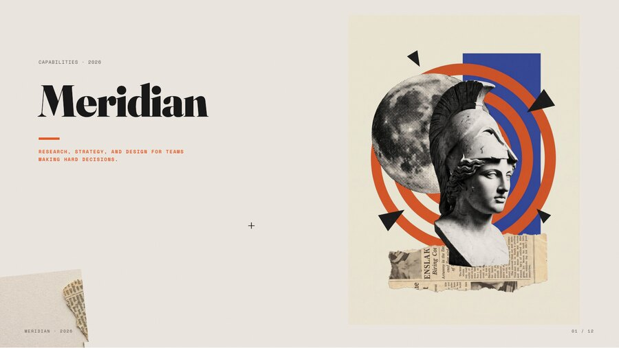
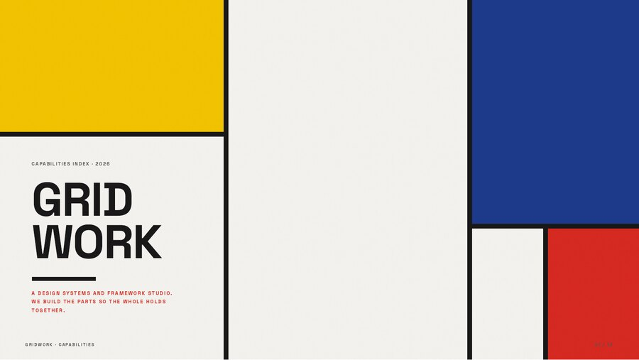
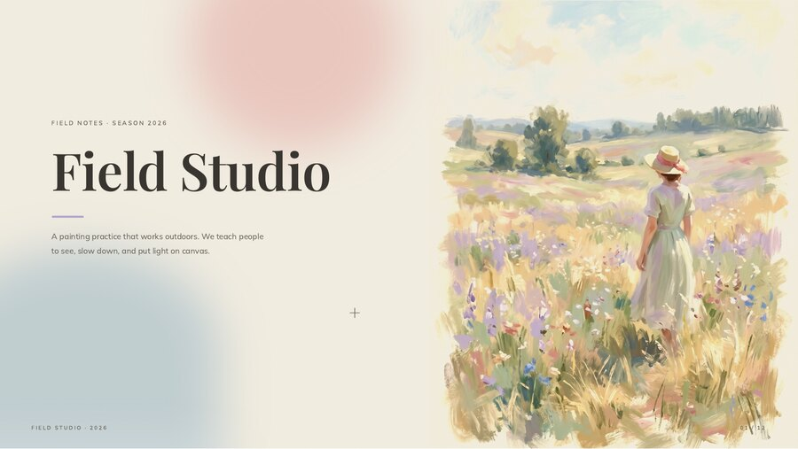
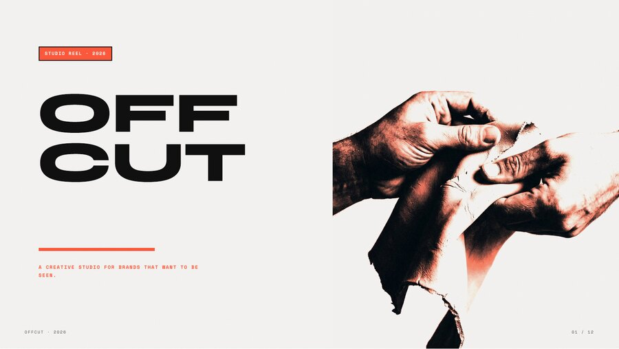
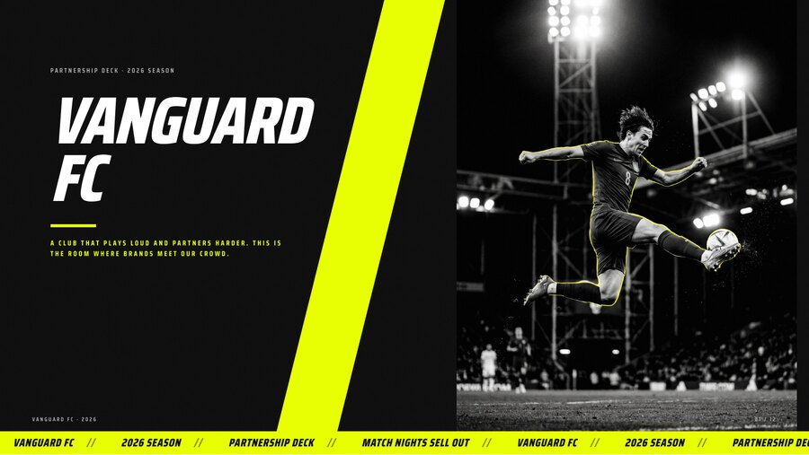
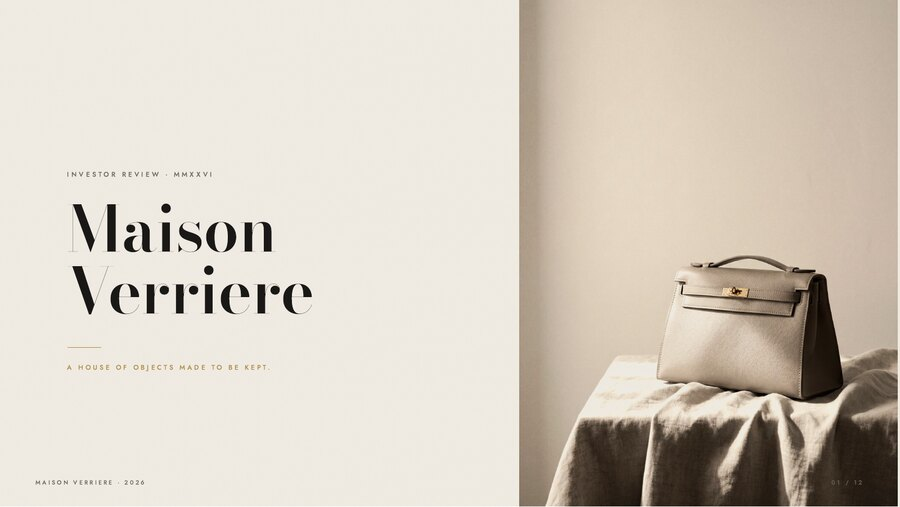
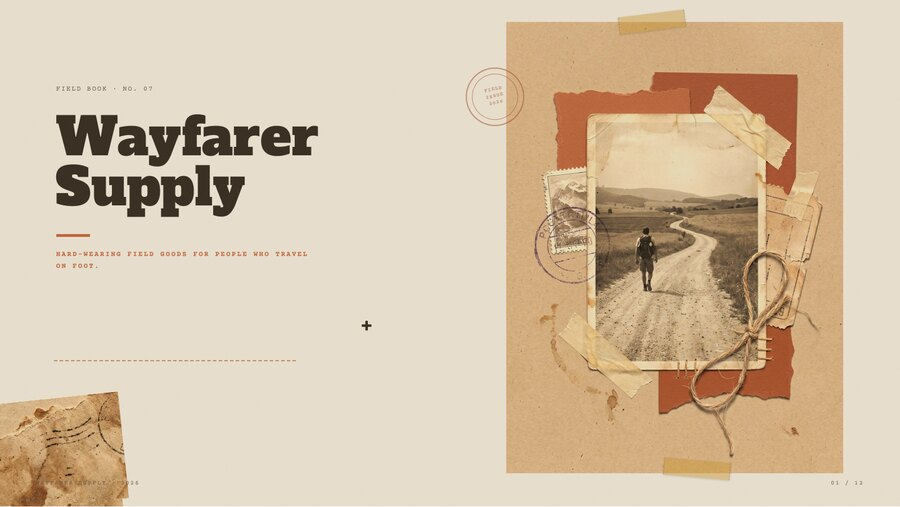
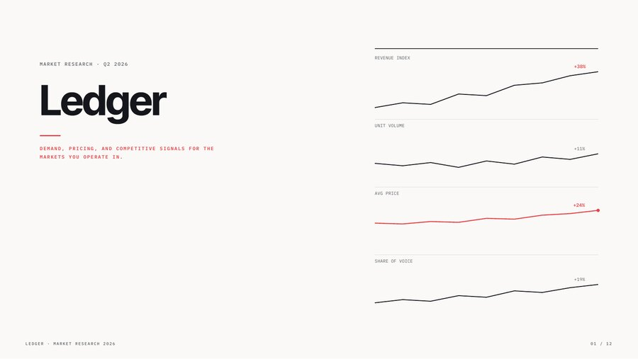
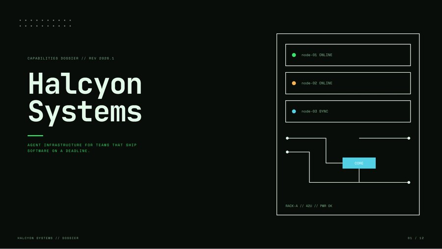
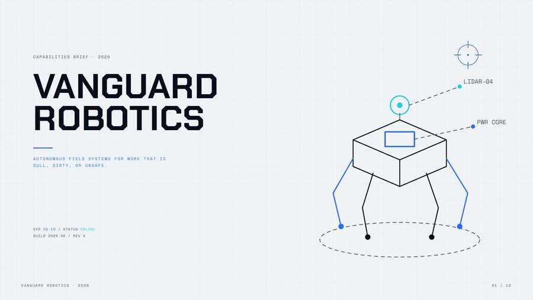

# Deck Kit

**Ten editorial slide-deck templates, as self-contained HTML.** Point it at a topic, a document, a
repo, or a brief, and it produces a 16:9 deck you can open in any browser, edit in place, and export
to a pixel-accurate PDF. No build step to view, no fonts to install, no server.


---

## What it is

A library of ten deck styles that all share one backbone (12 slides, the same chrome, the same export)
but each look like a different studio made them. Drop in your content and pick a look. Four of the
templates draw their visuals as inline SVG; six use mixed-media imagery. Every deck is one HTML file
with fonts and images bundled in.

Each deck, out of the box, can:

- **Navigate** with arrow keys, space, or on-screen controls.
- **Switch palette** live from a small toolbar.
- **Edit text in place** (press `E`), then **Save**.
- **Swap any image** in edit mode by clicking it or dropping a file on it (auto-downscaled).
- **Export a PDF** in one click that matches the screen exactly, with fonts embedded.

## See it in action

`examples/fable5/` is one real report (the launch of Anthropic's Claude Fable 5) rendered
through all ten templates, with the real benchmark figures. It is the clearest way to see how the
same content reads in ten different voices.

## The ten templates

Click any thumbnail to open the **live, interactive deck** (all twelve slides, arrow-key navigation,
palette switching, PDF export) on GitHub Pages.

| | Template | Best for |
|---|---|---|
| <a href="https://aref-vc.github.io/deck-kit-skill/templates/01-newsroom/deck.html"></a> | **01 · Newsroom** — editorial collage (sculpture, newsprint, accent shapes) | Brand story, manifesto, research dossier |
| <a href="https://aref-vc.github.io/deck-kit-skill/templates/02-grid/deck.html"></a> | **02 · Grid** — Mondrian / De Stijl (colour planes, black rules) | Frameworks, design systems, modular breakdowns |
| <a href="https://aref-vc.github.io/deck-kit-skill/templates/03-plein-air/deck.html"></a> | **03 · Plein Air** — Impressionist (painterly, pastel) | Culture, vision, narrative |
| <a href="https://aref-vc.github.io/deck-kit-skill/templates/04-studio/deck.html"></a> | **04 · Studio** — creative agency (bold duotone, type-as-hero) | Pitches, portfolios, proposals |
| <a href="https://aref-vc.github.io/deck-kit-skill/templates/05-arena/deck.html"></a> | **05 · Arena** — sports (dark, motion duotone, ticker) | Sponsorship, sports business, performance |
| <a href="https://aref-vc.github.io/deck-kit-skill/templates/06-maison/deck.html"></a> | **06 · Maison** — luxury (Didone, gold, deep negative space) | Investor / board, premium brand |
| <a href="https://aref-vc.github.io/deck-kit-skill/templates/07-drifter/deck.html"></a> | **07 · Drifter** — earthy (kraft, stamps, woodtype) | Travel, craft, sustainability, field reports |
| <a href="https://aref-vc.github.io/deck-kit-skill/templates/08-ledger/deck.html"></a> | **08 · Ledger** — data (Tufte-clean charts, one signal colour) | Market research, financial, KPI reviews |
| <a href="https://aref-vc.github.io/deck-kit-skill/templates/09-terminal/deck.html"></a> | **09 · Terminal** — dark CRT console (monospace, schematics) | Repos, architecture, AI / agent systems |
| <a href="https://aref-vc.github.io/deck-kit-skill/templates/10-vanguard/deck.html"></a> | **10 · Vanguard** — futuristic (wireframe, HUD) | Deep-tech, robotics, R&D |

Prefer a single still of every slide? The full 12-slide patchworks are in [`screenshots/`](screenshots)
(the `*-grid.jpg` files). The same content rendered in all ten styles is the
[Fable 5 example](https://aref-vc.github.io/deck-kit-skill/).

## Install as a Claude skill

This repository **is** a Claude skill (a `SKILL.md` at the root plus its resources). For Claude Code,
clone it into your skills directory:

```bash
git clone https://github.com/aref-vc/deck-kit-skill.git ~/.claude/skills/deck-kit
```

Then just ask Claude for a deck, or type `/deck-kit`:

> Build me a luxury-style pitch deck from this brief …

Claude reads `SKILL.md`, picks a template, maps your content onto the twelve slides, handles imagery,
and hands back a single self-contained `deck-standalone.html`. For claude.ai, zip this folder and
upload it under **Settings → Features**.

Optional: for fresh, topic-matched imagery on the six photo templates, also install the companion
[`gemini-imagegen`](https://github.com/anthropics/skills) skill and set `GEMINI_API_KEY`. The four SVG
templates (Grid, Ledger, Terminal, Vanguard) need nothing.

## Use it by hand (no skill needed)

```bash
# 1) scaffold a new deck from a template
scripts/new-deck.sh my-deck 04-studio
# 2) edit my-deck/deck.html (or open it and press E to edit text and images in place)
# 3) build the single self-contained file
cd my-deck && python3 build-standalone.py     # -> deck-standalone.html
```

## Project structure

```
deck-kit/                  (this repo, cloned to ~/.claude/skills/deck-kit)
  SKILL.md                 the skill: when to use it + the build workflow
  TEMPLATES.md             registry of the ten templates
  templates/01..10/        each template: deck.html, assets/, vendor/ (fonts + lib), build-standalone.py
  references/              palettes, slide-types, imagery rules
  library/                 reusable collage assets + manifest
  scripts/                 new-deck.sh, add-image-swap.py
  examples/fable5/         the Fable 5 report, rendered ten ways
  screenshots/             covers + 12-slide patchworks
  README.md, index.html    presentation + gallery (not used by the skill itself)
```

## Dependencies

- **To view, edit, or export a deck:** none. Each deck is a self-contained HTML file. Fonts are
  bundled locally (so the PDF embeds them), and the only library, used for PDF capture, is vendored in.
- **To generate fresh imagery** for the six photo templates: an image generator (this kit uses Google's
  Gemini via the `gemini-imagegen` skill). This is optional and build-time only. The four SVG templates
  (Grid, Ledger, Terminal, Vanguard) never need it, and any photo template can ship with its bundled
  art.

## Notes

- Bundled fonts are open-licensed (SIL OFL / Apache 2.0) and safe to redistribute.
- `deck-standalone.html` and `*.pdf` are generated artifacts and are git-ignored; regenerate with
  `build-standalone.py`.
- Dark photo templates must use dark-background imagery placed directly, never the light-theme multiply
  bake (it crushes images to black). See [`references/image-prompts.md`](references/image-prompts.md).
- `python3 scripts/check-decks.py` asserts every template and example deck shares the same core chrome
  (navigation, palette, inline editing, PDF export, image swap). Run it as a pre-push or CI guard so a
  template-only change can't silently skip the examples.
