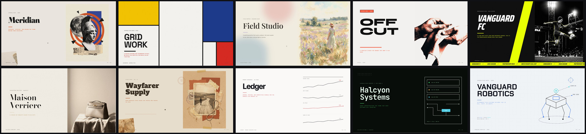

# Deck Kit

**Ten editorial slide-deck templates, as self-contained HTML.** Point it at a topic, a document, a
repo, or a brief, and it produces a 16:9 deck you can open in any browser, edit in place, and export
to a pixel-accurate PDF. No build step to view, no fonts to install, no server.



---

## What it is

A library of ten deck styles that all share one backbone (12 slides, the same chrome, the same export)
but each look like a different studio made them. Drop in your content and pick a look. Four of the
templates draw their visuals as inline SVG; six use mixed-media imagery. Every deck is one HTML file
with fonts and images bundled in.

Each deck, out of the box, can:

- **Navigate** with arrow keys, space, or on-screen controls.
- **Switch palette** live from a small toolbar.
- **Edit text in place** (press `E`), then **Save**.
- **Swap any image** in edit mode by clicking it or dropping a file on it (auto-downscaled).
- **Export a PDF** in one click that matches the screen exactly, with fonts embedded.

## See it in action

`deck-kit/examples/fable5/` is one real report (the launch of Anthropic's Claude Fable 5) rendered
through all ten templates, with the real benchmark figures. It is the clearest way to see how the
same content reads in ten different voices.

## The ten templates

| | Template | Best for |
|---|---|---|
|  | **01 · Newsroom** — editorial collage (sculpture, newsprint, accent shapes) | Brand story, manifesto, research dossier |
|  | **02 · Grid** — Mondrian / De Stijl (colour planes, black rules) | Frameworks, design systems, modular breakdowns |
|  | **03 · Plein Air** — Impressionist (painterly, pastel) | Culture, vision, narrative |
|  | **04 · Studio** — creative agency (bold duotone, type-as-hero) | Pitches, portfolios, proposals |
|  | **05 · Arena** — sports (dark, motion duotone, ticker) | Sponsorship, sports business, performance |
|  | **06 · Maison** — luxury (Didone, gold, deep negative space) | Investor / board, premium brand |
|  | **07 · Drifter** — earthy (kraft, stamps, woodtype) | Travel, craft, sustainability, field reports |
|  | **08 · Ledger** — data (Tufte-clean charts, one signal colour) | Market research, financial, KPI reviews |
|  | **09 · Terminal** — dark CRT console (monospace, schematics) | Repos, architecture, AI / agent systems |
|  | **10 · Vanguard** — futuristic (wireframe, HUD) | Deep-tech, robotics, R&D |

Full 12-slide patchworks for each are in [`screenshots/`](screenshots) (the `*-grid.jpg` files).

## How to use it

**With Claude (the intended path).** Ask it to build a deck in a given template from your input. It
maps your content onto the twelve sections, regenerates or selects imagery, and produces the deck.
The spec it follows is [`deck-kit/BUILD.md`](deck-kit/BUILD.md).

**By hand.**

```bash
# 1) scaffold a new deck from a template
deck-kit/scripts/new-deck.sh my-deck 04-studio

# 2) edit the content in my-deck/deck.html (or open it and press E to edit in place)

# 3) build the single self-contained file
cd my-deck && python3 build-standalone.py     # -> deck-standalone.html

# open deck-standalone.html anywhere, or deck.html via a local server
```

## Project structure

```
deck-kit/
  BUILD.md                 the build spec (how a deck gets made)
  TEMPLATES.md             the registry of the ten templates
  templates/01..10/        each template: deck.html, assets/, vendor/ (fonts + lib), build-standalone.py
  references/              palettes, slide-types, imagery rules
  library/                 reusable collage assets + manifest
  scripts/                 new-deck.sh, add-image-swap.py
  examples/fable5/         the Fable 5 report, rendered ten ways
screenshots/               covers + 12-slide patchworks (used here and on the gallery page)
index.html                 a gallery page (GitHub Pages)
```

## Dependencies

- **To view, edit, or export a deck:** none. Each deck is a self-contained HTML file. Fonts are
  bundled locally (so the PDF embeds them), and the only library, used for PDF capture, is vendored in.
- **To generate fresh imagery** for the six photo templates: an image generator (this kit uses Google's
  Gemini via the `gemini-imagegen` skill). This is optional and build-time only. The four SVG templates
  (Grid, Ledger, Terminal, Vanguard) never need it, and any photo template can ship with its bundled
  art.

## Notes

- Bundled fonts are open-licensed (SIL OFL / Apache 2.0) and safe to redistribute.
- `deck-standalone.html` and `*.pdf` are generated artifacts and are git-ignored; regenerate with
  `build-standalone.py`.
- Dark photo templates must use dark-background imagery placed directly, never the light-theme multiply
  bake (it crushes images to black). See [`deck-kit/references/image-prompts.md`](deck-kit/references/image-prompts.md).
